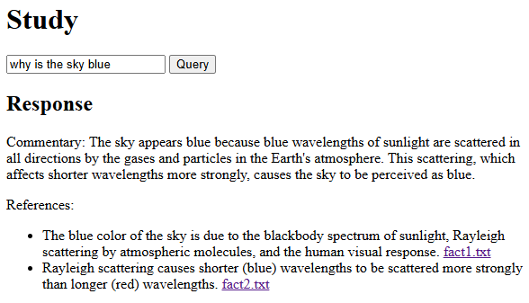
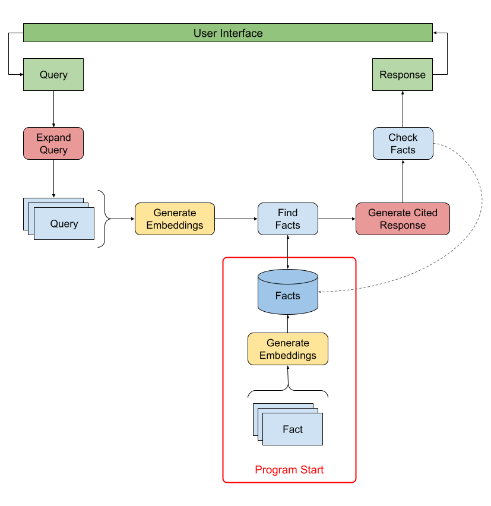

# Study

A retrieval augmented generation (RAG) app.

## User Interface

## Flows
There are two flows within the program. One that happens at program start time,
and another that happens for each user query submitted through the UI.

### Diagram

### At Startup
When the program starts up, each local file has an embedding generated for its
entire contents. This prepares local content for similarity scoring against
user queries.

- Program starts
- Local fact directory is scanned for files (assumed `.txt`)
- Each file has its embedding generated and stored in-memory
- UI starts, user can submit a query

### On User Query
When a user submits a query via the UI, the user-supplied query is expaned. The
original query and all expanded queries are compared to facts and a cited
response is generated. The facts cited in the response are checked against
locally stored facts. Finally, the response is rendered in the UI.

- User submits a query (ex: "why is the sky blue?")
- The query is expanded into multiple related queries
- An embedding is generated for each query (original + expanded queries)
- Each query embedding is matched with similar in-memory facts
- Queries and facts are used to prompt for a cited response
- Facts referenced in the cited response are checked (existence only)
- Fact-checked response is provided to the user (free-form commentary + references)

## Configuration
Configuration is handled through environment variables:

- OPENAI_API_KEY **(required)**
- OPENAI_LANGUAGE_MODEL (default: `gpt-4o`)
- OPENAI_EMBEDDING_MODEL (default: `text-embedding-3-large`)

## Limitations
- Fact storage and search is inefficient
- Fact storage does not persist
- Fact storage is not continuous
- Fact checking does not check meaning, only existence of files referenced
- User experience is a single query/response, no persistence or threading

## Implementation
- Single-file, sub-1k LoC Go program [main.go](main.go)
- Configuration via environment variables [run.bat](run.bat)
- No dependencies except the Go standard library
